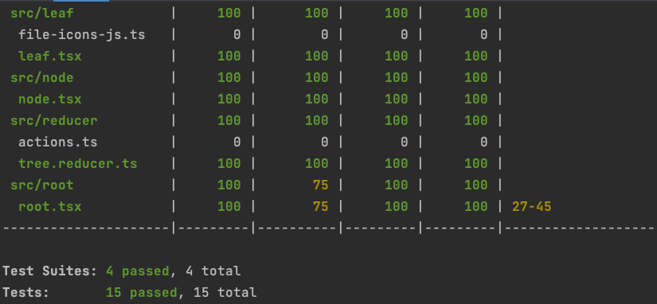

# stepsize-task-file-tree
A Typescript React app that runs in the browser, and renders a file tree of the files &amp; folders in the repository, from JSON files

## Known limitations
 * Select box doesn't select the repo which was loaded from the SessionStorage
 * No way to know if a leaf node is actually an empty folder, so we can't append the "/" for the File Icons repo 
 * File icons repo doesn't seem to have a folder icon and uses a "default" icon even if the filename ends with "/"

## Third-party software
 * create-react-app (and anything bundled with it)
 * [@exuanbo/file-icons-js](https://github.com/exuanbo/file-icons-js#readme)

## Dev Summary
This was an interesting exercise in changing the format of data and in returning to a framework I hadn't used for a while. As I had pointed out during our technical discussion, an engineer at this level should be able to switch between frameworks with his knowledge of the programming principles (knowing what he wants to do) and efficient use of Google/StackOverflow.

To speed up starting this challenge I used `create-react-app` using the TypeScript template to provide boilerplate code to start coding.

I approached this challenge using Test-Driven Development and started from the smallest piece of functionality. I started developing the Leaf component to display the file/folder (node) name and choose an icon from the required library. I couldn't get this library to bundle with the development code with `npm run start`, so I removed it as a package dependency and added the CDN-loaded files as `<script>` and `<link>` elements in `index.html`. From there I moved on to the Node component, which would handle rendering a Leaf and, if required, the node's sub-tree.

I decided to use a reducer to manipulate the data. This allowed me to write the code for expanding and collapsing groups in one place. I also made the decision here to make the hook's dispatcher function available to all Node components in the tree using a React Context rather than passing the function as a prop. This had the benefit of allowing me to move the Context to a different component, later on, without having to change much code. The React documentation also suggests using a Context for shared functions in this way.

Finally, the Root component was created to display all of the previous work (it was test-driven, so it hadn't been made pretty, yet) which would handle transforming the JSON data structure into the tree structure used by the Node component, and the saving and fetching of saved tree state. SessionStorage was chosen as it satisfied the constraint of persisting the data during a refresh. It would not persist if the browser were closed, but that wasn't given as a requirement.

The app was written considering tree accessibility from the beginning. The selectors in the unit tests are accessible element selectors such as "role" or "text" rather than classnames or "testids" to encourage this. I was going to add keyboard interactions (the `const [selected, setSelected] = useState(false);` was the starting point for this), but I felt it would have added little to the assessment compared to the time. For production code I would strongly suggest it be implemented, as accessibility is a must-have rather than a nice-to-have. It should be possible to move between nodes using the arrow keys and to expand and collapse them with a key (probably Enter or Spacebar).

Oddly, the test coverage report suggests that lines 27-45 are not covered by tests. Lines 27-33 are required to load the repository data and transform it into tree data, so I'm not sure why those would be not covered by the tests which render trees. Lines 35-45 relate to saving the tree state; these are not covered by tests for brevity.

I hope you'll agree that the code here is of high quality with good tests. It did not take me very long to get back into the "React" way of doing things and, given how fast tech moves, there may well be "better" ways to do things: every day is a learning day.